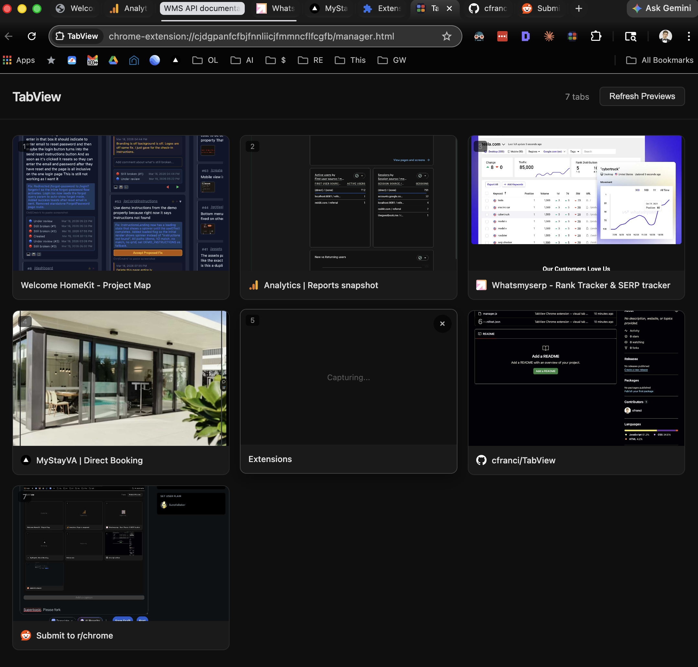

  

<h1 align="center">TabView</h1>

  A Chrome extension that lets you see all your tabs as visual previews in a single grid — close them, reorder them, or jump to any tab instantly.

  

---

## Features

- **Visual tab previews** — Captures screenshots of all tabs in the background (no disruptive tab switching)
- **Close tabs** — Hit the X on any card to close it with a smooth animation
- **Drag & drop reorder** — Drag cards to rearrange your actual Chrome tab order
- **Click to switch** — Click any preview or title to jump straight to that tab
- **Live updates** — Grid stays in sync as you open, close, or move tabs
- **Auto-capture** — Previews start capturing automatically when you open TabView

## Install (Developer Mode)

TabView isn't on the Chrome Web Store — install it manually in about 30 seconds:

1. **Download** this repo:
   - Click the green **Code** button above → **Download ZIP**
   - Or clone it: `git clone https://github.com/cfranci/TabView.git`

2. **Open Chrome's extension page**:
   - Go to `chrome://extensions` in your address bar

3. **Enable Developer Mode**:
   - Toggle the **Developer mode** switch in the top-right corner

4. **Load the extension**:
   - Click **Load unpacked**
   - Select the `TabView` folder you downloaded/cloned

5. **Pin it** (optional but recommended):
   - Click the puzzle piece icon in Chrome's toolbar
   - Pin **TabView** so it's always one click away

## Usage

Click the **TabView** icon in your toolbar. A new tab opens with a grid of all your tabs. Previews capture automatically — you'll see a brief "debugging" indicator on tabs as they're screenshotted (this is normal and harmless).

- **Click a preview** → switches to that tab
- **Click the ✕** → closes that tab
- **Drag a card** → reorders the tab in Chrome
- **"Refresh Previews"** → re-captures all screenshots

## Permissions

- **tabs** — Read tab titles, URLs, and favicons
- **activeTab** — Access the current tab
- **debugger** — Capture tab screenshots without switching tabs (uses Chrome DevTools Protocol)

## License

MIT
